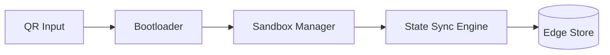

<div align="center">
  <h1>Q-OS</h1>
  <p><strong>QR-triggered WebAssembly Edge Runtime</strong></p>

  [](https://www.rust-lang.org/)
  [](LICENSE)
  [](https://wasmtime.dev/)
</div>

<br />

**Q-OS** is a lightweight, secure runtime that executes WebAssembly (WASM) modules triggered instantly by **QR code scans**. 

Built entirely in Rust, it is designed for constrained edge hardware such as Raspberry Pis, industrial gateways, and kiosk terminals. Q-OS is built for environments where network access may be intermittent, but security posture and execution isolation must be verifiable entirely offline.

---

## ✨ Features

- **Zero-Touch Execution**: Scan a QR code, and the embedded or linked WASM module executes immediately in a secure sandbox.
- **Offline Verifiable Security**: Modules are content-addressed (SHA-256) and cryptographically signed (Ed25519) to ensure they haven't been tampered with.
- **Strict Isolation**: Every module invocation runs in a fresh Wasmtime-powered sandbox with strict memory isolation.
- **Capability-Gated Host ABI**: A strict "deny-by-default" policy for host capabilities. Modules must explicitly request access to network, storage, or peripherals.
- **Pluggable State Sync**: Integrates with robust state engines (like `sled`) to manage edge state with optional backend syncing when the network is available.

## 🚀 Quick Start

### Prerequisites

You will need the Rust toolchain installed:
```bash
curl --proto '=https' --tlsv1.2 -sSf https://sh.rustup.rs | sh
```

### Building the Project

Clone the repository and build the workspace:
```bash
git clone https://github.com/donwolfonline/QOS.git
cd QOS
cargo build --workspace
```

### Running Tests

Ensure everything is functioning correctly by running the test suite:
```bash
cargo test --workspace
```

### Usage Examples

**Run the CLI (Developer Tool) on a QR image:**
You can test the module execution locally by passing a QR code image to the `qos-cli`. The `--no-strict` flag bypasses strict Ed25519 signature checks for local development.
```bash
cargo run --bin qos-cli -- run path/to/qr.png --no-strict
```

**Start the Edge Daemon:**
To run Q-OS as a continuous background daemon on edge hardware:
```bash
cargo run --bin qos-runtime -- --config qos.toml
```

## 🧠 Architecture

Q-OS processes inputs through a secure, linear pipeline ensuring no malformed data reaches the execution layer.



For an in-depth look at the architecture design and module fetching layers, see [ARCHITECTURE.md](docs/ARCHITECTURE.md).

## 🛡️ Security Model

Security is at the core of Q-OS, designed for untrusted physical environments:

- **Content-Addressing:** All modules are fetched and cached based on their SHA-256 hash.
- **Signature Verification:** In strict mode, only modules signed by a trusted Ed25519 keypair are allowed to execute.
- **Wasmtime Sandboxing:** Best-in-class sandboxing provides per-invocation memory and execution isolation.
- **Auditing:** We utilize `cargo-deny` in CI/CD to automatically audit the dependency tree for known CVEs and license compliance issues.

For detailed threat modeling and security policies, read our [SECURITY.md](docs/SECURITY.md) documentation.

## 📂 Project Layout

The repository is organized into isolated, purpose-built crates to minimize dependencies and maintain security boundaries:

```text
QOS/
├── crates/
│   ├── qos-types          # Shared domain types (zero internal dependencies)
│   ├── qos-crypto         # Cryptographic primitives (SHA-256, Ed25519)
│   ├── qos-policy         # URI allow-lists & WASM capability policies
│   ├── qos-qr             # QR decoding and data extraction
│   ├── qos-fetch          # Async fetcher for remote WASM modules
│   ├── qos-cache          # LRU cache for compiled WASM binaries
│   ├── qos-bootloader     # Layer 1: System orchestration and setup
│   ├── qos-host-abi       # Layer 1.5: WASM ↔ Host import surface definitions
│   ├── qos-sandbox        # Layer 2: Wasmtime runtime wrapper
│   ├── qos-state          # Layer 3: Local Key-Value store (sled)
│   └── qos-sync-adapters  # Pluggable backend sync adapters
└── bins/
    ├── qos-runtime        # The primary Edge Daemon binary
    └── qos-cli            # Developer CLI tools
```

## 🤝 Contributing

We welcome contributions! Please check our open issues or submit a PR if you have improvements. Make sure to run `cargo fmt` and `cargo clippy` before submitting your code. 

## 📜 License

This project is dual-licensed under either the **MIT License** or the **Apache License, Version 2.0**. 

See the [LICENSE](LICENSE) file for more details.
