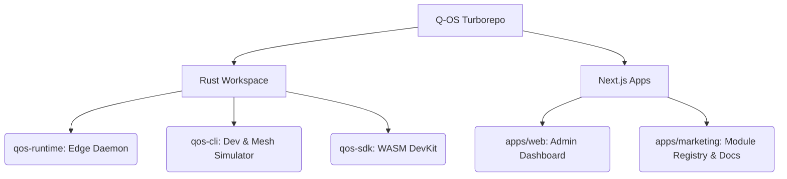

<div align="center">
  
  <h1>Q-OS: The Serverless Edge Protocol</h1>
  <p><strong>Deploy WebAssembly modules directly to the physical floor. Zero cloud costs, sub-millisecond execution, and unbreakable P2P mesh synchronization.</strong></p>

  [](https://www.rust-lang.org/)
  [](LICENSE)
  [](https://wasmtime.dev/)
</div>

<br />

## 🌐 What is Q-OS?

**Q-OS** is a next-generation distributed operating system designed specifically for the physical edge. It allows you to run sandboxed WebAssembly (WASM) modules on resource-constrained hardware (Raspberry Pis, industrial gateways, POS systems) with absolute security, local state persistence, and real-time mesh networking.

Instead of relying on centralized cloud providers, Q-OS nodes form a **Local/Global P2P Mesh**. When a WASM module mutates state, the change is instantly propagated across the local mesh using Conflict-Free Replicated Data Types (CRDTs) over `libp2p` Gossipsub. 

### 🚀 Core Pillars

- **Write in Any Language (WASM):** Write your edge logic in Rust, Go, or C/C++. The `qos-cli` compiles it down to a highly optimized `.qos` binary.
- **Global DHT Discovery (libp2p):** Edge nodes dynamically discover each other. No central orchestrator required. If the internet goes down, the local mesh stays alive.
- **Cryptographic Monetization:** Developers can publish modules to the **Q-OS Registry**. Modules are cryptographically signed (Ed25519). Businesses purchase licenses, and the runtime strictly enforces DRM and expiry entirely offline.

---

## 🏗️ Ecosystem Architecture

Q-OS is managed as a monolithic Turborepo workspace orchestrating both the low-level Rust daemon and the high-level Next.js web applications.



### The Rust Stack
* **`qos-runtime`**: The daemon running on the edge. Embeds a `Sled` key-value database, a `Wasmtime` execution engine, and a `libp2p` swarm.
* **`qos-cli`**: The developer CLI. Used to initialize projects (`qos init`), build WASM modules (`qos build`), deploy (`qos module deploy`), and run multi-node integration tests (`qos simulate mesh`).
* **`qos-sdk`**: Provides the host ABI bindings (`state::get`, `gossip::publish`) for WASM modules to securely interact with the host node.

### The Web Stack
* **`apps/web`**: A modern Next.js Command Center for node administrators to view telemetry, manage cryptographic licenses, and visualize the local P2P topology.
* **`apps/marketing`**: The developer portal, documentation, and the **Q-OS Module Registry** where developers monetize their WASM logic.

---

## ⚡ Developer Quick Start

### 1. Install the CLI
Install the Q-OS CLI toolchain on your machine:
```bash
curl -sL https://q-os.io/install | bash
```

### 2. Initialize a Module
Create a new edge agent using the Rust template:
```bash
qos init my-edge-agent --template rust
cd my-edge-agent
```

### 3. Write Edge Logic
Write your logic using the `qos-sdk`. Q-OS handles the state management and network propagation for you.
```rust
use qos_sdk::{state, gossip, output};

#[no_mangle]
pub extern "C" fn execute() {
    // Read from the local Sled DB
    let mut count = state::get("visitor_count").unwrap_or(0);
    count += 1;
    
    // Persist locally
    state::set("visitor_count", count);
    
    // Broadcast instantly to the local mesh
    gossip::publish("metrics", format!("visitors: {}", count).as_bytes());
    
    output::write_json(&serde_json::json!({ "status": "success", "count": count }));
}
```

### 4. Build & Simulate
You don't need real hardware to test a distributed mesh. Use the built-in simulator to spawn multiple Tokio-isolated nodes on your local machine:
```bash
qos build
qos simulate mesh --nodes 3 --module ./target/wasm32-unknown-unknown/release/my_edge_agent.qos
```

---

## 🔒 Security Model & DRM

Q-OS is designed for environments where physical hardware is completely untrusted.
1. **Module Hashing**: All execution is based on content-addressed SHA-256 hashes.
2. **Offline DRM**: When a module is purchased from the Registry, a Cryptographic License Payload is generated, binding the buyer's Edge Node ID to the Module Hash. 
3. **Ed25519 Signatures**: The daemon strictly verifies the signature against the Q-OS Master Public Key before allowing execution. 

---

## 🛠️ Building from Source

To build the entire ecosystem (WebApps + Rust binaries), run the master build pipeline:

```bash
pnpm install
pnpm run build:all
```

*Note: Turborepo caching is highly optimized. Rust compilation will be skipped if the core libraries haven't changed.*

To package a production release (compresses the runtime, CLI, and exported Web UI into a portable `.tar.gz`):
```bash
./scripts/prepare_release.sh
```

## 📜 License

This project is dual-licensed under either the **MIT License** or the **Apache License, Version 2.0**. See the [LICENSE](LICENSE) file for more details.
